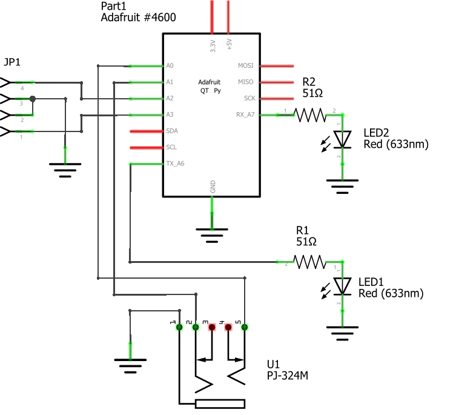
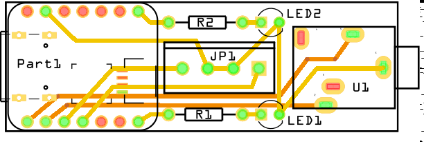
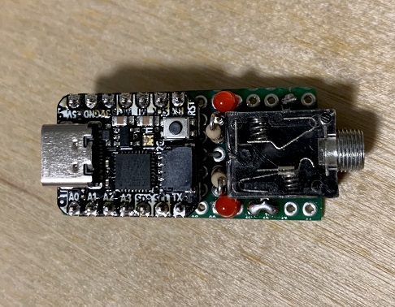
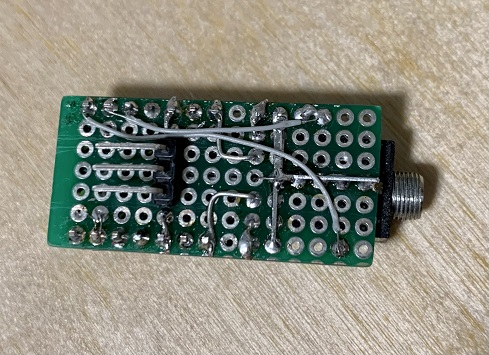

# CWKeyboard

This program emulates a USB Keyboard for sending input from Morse code iambic paddles, straight key, or electronic keyer to applications that use keyboards to send morse code. It does not translate the input to characters or Morse code dits and dahs. This first iteration is made to work with the [vband virtual cw band website](https://hamradio.solutions/vband/) by Ham Radio Solutions.

The code was written for the Adafruit QT Py SAMD21 Dev Board but should work with any microcontroller that supports the Arduino development environment and USB keyboard emulation. You may have to change pin assignments or remove the NeoPixel code depending on the microcontroller development board you choose.

The code defaults to iambic paddle mode. Ground pin A2 (D2) to switch to straight key mode or ground pin A3 (D3) to switch to electronic keyer mode and then reboot the adapter. The mode is set when the adapter starts up. When in paddle mode, the on-board LED will glow green, when in straight key mode, the LED will glow RED and when in keyer mode it will glow blue.

When in straight key mode or keyer mode, only the dit pin will be active so wire your key or keyer to that pin. The dah pin is disabled in case you connect your key using a mono plug in a stereo jack. If you use a stereo plug and don't connect the ring to ground, you don't need to switch to straight key mode. However, you may want to switch to keyer mode if you use an electronic keyer to reduce the latency caused by the switch debounce code.

The LEDs, resistors, and the mode selector jumper are optional. If you want to build a compact and minimal adapter, you can omit them. You can also modify the code to remove the mode pins and configure one straight key or keyer mode to be the default mode.

In my prototype, I oriented the resistors vertically, placed the mode jumpers on the back of the pcb, and routed wires on both sides of the board to create a compact version. It's possible to remove the LEDs and jumpers and locate the 3.5mm jack on the back of the pcb to make a very compact version.

The HID-Project library will also emulate a USB game controller if you have software that uses game controller input for the keyer. You will have to use a version of the HID-Project library later than 2.6.1 or grab the latest source code and install the library manually.
